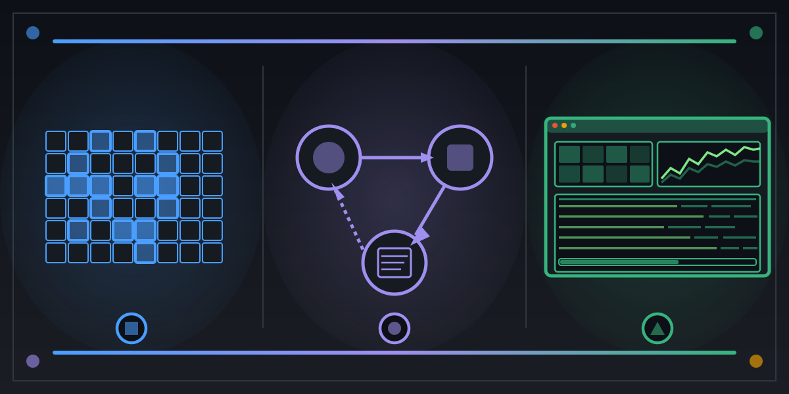

# tui-from-zero

<p align="center">
  
</p>

[](https://github.com/paiml/tui-from-zero/actions/workflows/ci.yml)
[](#license)
[](https://www.rust-lang.org/)
[](Cargo.toml)
[](#quality-gates)
[](contracts/)

Companion repository for the **TUI from Zero** Coursera course — a planned addition to the
[Rust for Data Engineering](https://www.coursera.org/specializations/rust-for-data-engineering)
specialization (slot TBD; see [`docs/tui-from-zero-design.md`](../course-studio/docs/tui-from-zero-design.md)
in the `course-studio` repo for the in-progress curriculum spec).

The course teaches `presentar` — the pure-Rust TUI framework from
[`paiml/aprender`](https://github.com/paiml/aprender). Every crate in this workspace **depends
on real, published `aprender-present-*` crates from crates.io** (v0.33 at time of writing) and
**uses `aprender-present-test` (probar) as a dev-dependency** for snapshot testing.

## How this differs from a typical "from-zero" book

- **No reinvention.** The cell buffer, diff renderer, widget trait, color type, and 20+ TUI widgets all come from `presentar` — the same crate the production `ptop` ships against. Your `m1-cellbuffer::CellBuffer` IS `presentar_terminal::CellBuffer`.
- **Contracts as the source of truth.** Three YAML files in [`contracts/`](contracts/) declare every invariant; [`pv`](https://github.com/paiml/aprender/tree/main/crates/aprender-contracts-cli) validates them; runtime asserts in each demo binary check the obligation at exit; [Lean 4 theorems](lean/TuiFromZero/Theorems/) discharge the universal claim.
- **Probar snapshot tests, one per crate.** `tests/probar_snapshot.rs` in each crate uses the snapshot pattern pioneered by `jugar-probar` / `aprender-present-test` to assert presentar's CellBuffer output against an inline golden — TUI testing without a browser, without Selenium.

## The three pillars (Render · React · Compose)

| Pillar | Contract | What it gates | Demo crates that prove it at runtime |
|---|---|---|---|
| **Render** | [`tui-rendering-v1`](contracts/tui-rendering-v1.yaml) | CellBuffer bounds safety · diff-render equivalence · zero-alloc steady state · double-width Unicode safety · color-mode totality | [`m1-cellbuffer`](m1-cellbuffer/), [`m1-widgets`](m1-widgets/), [`m4-tests`](m4-tests/) |
| **React** | [`tui-lifecycle-v1`](contracts/tui-lifecycle-v1.yaml) | Elm-style update totality · view referential transparency · event-replay determinism · terminal-restore on quit | [`m2-elm-counter`](m2-elm-counter/), [`m2-input`](m2-input/) |
| **Compose** | [`tui-panels-v1`](contracts/tui-panels-v1.yaml) | Composite widgets never overflow parent rect · panel layout non-overlap · monotonic progress · cost display non-negative | [`m3-sparkline`](m3-sparkline/), [`m3-panels`](m3-panels/), [`m4-yaml-scene`](m4-yaml-scene/), [`m5-ptop-mini`](m5-ptop-mini/) |

Current `pv score` (5-dimension rubric):

```
tui-lifecycle-v1 — 0.81 (B)  Spec 0.75 · Falsify 1.00 · Kani 0.50 · Lean 1.00 · Bind 1.00
tui-rendering-v1 — 0.65 (C)  Spec 0.75 · Falsify 1.00 · Kani 0.66 · Lean 1.00 · Bind 0.00
tui-panels-v1    — 0.60 (D)  Spec 0.75 · Falsify 1.00 · Kani 0.44 · Lean 1.00 · Bind 0.00
```

Lifting Kani (model-checking) and Bind (presentar binding registry) is the next iteration.
See [`contracts/binding.yaml`](contracts/binding.yaml) for the contract → crate map.

## Demos

Nine workspace crates, one demo binary each. Each binary prints `contract: <name> — OK` on
stderr at exit; the [CI workflow](.github/workflows/ci.yml) greps for that marker as the
runtime half of the proof.

| Crate | What it teaches | Gating contract | Demo binary |
|---|---|---|---|
| [`m1-cellbuffer`](m1-cellbuffer/) | Cell buffer + diff renderer (re-exports `presentar_terminal::{Cell, CellBuffer, DiffRenderer}`) | `tui-rendering-v1` | `cellbuffer-demo` |
| [`m1-widgets`](m1-widgets/) | A `Widget` trait + `Container`/`Row`/`Column` composite, painting into `presentar`'s CellBuffer | `tui-rendering-v1` | `widgets-demo` |
| [`m2-elm-counter`](m2-elm-counter/) | The Elm architecture in ~80 lines: `init() / update(state, msg) / view(state)` with a proptest harness proving replay determinism | `tui-lifecycle-v1` | `counter-demo` |
| [`m2-input`](m2-input/) | Total `dispatch(KeyEvent) -> Option<Msg>` via `crossterm` (the same input layer presentar uses) | `tui-lifecycle-v1` | `input-demo` |
| [`m3-sparkline`](m3-sparkline/) | Unicode block-glyph sparkline (8 levels, single-cell resolution) | `tui-panels-v1` | `sparkline-demo` |
| [`m3-panels`](m3-panels/) | `CpuGrid` + `ProcessTable` + memory bar — composed into one frame | `tui-panels-v1` | `panels-demo` |
| [`m4-yaml-scene`](m4-yaml-scene/) | A minimal `.prs` scene loader that compiles `label/block` declarations into a Widget tree | `tui-panels-v1` | `scene-demo` |
| [`m4-tests`](m4-tests/) | `snapshot()` / `diff_snapshot()` — pure-Rust TUI testing without a browser | `tui-rendering-v1` | `tests-demo` |
| [`m5-ptop-mini`](m5-ptop-mini/) | The capstone — composes every prior crate into a live ptop-style dashboard with a `--ci` flag for the deterministic single-frame smoke | `tui-panels-v1` | `ptop-mini` |

`make demo` runs all nine in single-frame mode and asserts every contract marker.
`cargo run --release --bin ptop-mini` (no `--ci`) enters the live crossterm loop on a real
terminal — press `q`, `Esc`, or `Ctrl-C` to exit.

## Stack

| Layer | Where it comes from | Version |
|---|---|---|
| Terminal I/O | `crossterm` (presentar uses this too) | 0.28 |
| `CellBuffer`, `Cell`, `DiffRenderer`, `Color`, widget trait | [`aprender-present-core`](https://crates.io/crates/aprender-present-core) + [`aprender-present-terminal`](https://crates.io/crates/aprender-present-terminal) on crates.io | 0.33 |
| Snapshot testing (probar) | [`aprender-present-test`](https://crates.io/crates/aprender-present-test) as dev-dep | 0.31 |
| Contract validator + scorer | [`aprender-contracts-cli`](https://crates.io/crates/aprender-contracts-cli) (the `pv` binary) | latest |
| Lean 4 proofs | `lake build` over [`lean/TuiFromZero/Theorems/`](lean/TuiFromZero/Theorems/) (no Mathlib dependency — builds in <1 s) | v4.13.0 |
| Property tests | `proptest` | 1.x |

No git deps, no path deps to a sibling checkout — everything fetches from `crates.io`.

## Install

```bash
make install
```

This runs `cargo install aprender-contracts-cli` for the `pv` binary if it isn't already on
`PATH`. Everything else (presentar, probar, crossterm) downloads through `cargo build`.

### Prerequisites

- Rust 1.75+ (`rustup default stable`)
- Optional: `elan` + Lean 4 v4.13 for `make lean-build`
- Optional: [`cargo-llvm-cov`](https://crates.io/crates/cargo-llvm-cov) for `make coverage-test`

## Quick start

```bash
git clone https://github.com/paiml/tui-from-zero
cd tui-from-zero
make install

# Gate the contracts (schema + rubric)
make validate       # pv validate per contract — 0 errors expected
make score          # pv score per contract — prints the 5-dim rubric

# Build + run every demo
make build
make demo

# Type-check the Lean 4 proofs (~1 s)
make lean-build

# Probar snapshot tests (per-crate tests/probar_snapshot.rs)
cargo test --workspace --test probar_snapshot

# Full pre-merge gate
make ci             # fmt + clippy + workspace tests + coverage + pv lint
```

## Quality gates

`make ci` runs locally; the [CI workflow](.github/workflows/ci.yml) runs the same gates plus
runtime contract assertions on every push.

| Gate | Tool | Threshold |
|---|---|---|
| Formatting | `cargo fmt --all --check` | clean |
| Build | `cargo build --workspace --locked` | clean |
| Tests (unit + integration + probar snapshots) | `cargo test --workspace --locked` | **80 tests** currently pass |
| Line coverage | `cargo llvm-cov --workspace --fail-under-lines 95` | **95% gate** (local achieves 100%) |
| Clippy | `cargo clippy --workspace --all-targets -- -D warnings` | clean |
| Contract validation | `pv validate contracts/<name>.yaml` × 3 | 0 errors per contract |
| Contract lint (8 gates) | `pv lint contracts/<name>.yaml` × 3 | `Result: PASS` |
| Runtime contract markers | `cargo run --bin <demo>` × 9 | every binary emits its `contract: ... — OK` |
| Lean 4 proofs | `cd lean && lake build` | 6 theorems compile |
| PMAT comply (advisory) | `pmat comply check` | `continue-on-error: true` |

## Repository layout

```
contracts/
  tui-rendering-v1.yaml      Render-pillar invariants
  tui-lifecycle-v1.yaml      React-pillar invariants
  tui-panels-v1.yaml         Compose-pillar invariants
  binding.yaml               Contract → Rust crate binding manifest
  binding-index.json         Same in JSON for tooling
m1-cellbuffer/               re-export of presentar_terminal types + helpers
m1-widgets/                  Widget trait + Container/Row/Column + Block/Label
m2-elm-counter/              init/update/view (Elm architecture)
m2-input/                    KeyEvent → Msg dispatch (totality)
m3-sparkline/                Unicode block-glyph sparkline
m3-panels/                   CpuGrid + ProcessTable + memory bar
m4-yaml-scene/               .prs scene compiler → Widget tree
m4-tests/                    snapshot() + diff_snapshot() (probar-style)
m5-ptop-mini/                capstone — composes everything into a live ptop dashboard
lean/                        Lean 4 lakefile + theorems per pillar
.github/workflows/ci.yml     pv-gated CI
Makefile                     pv + cargo + lake one-button targets
assets/hero.{svg,png}        the image at the top of this README
```

## License

Dual-licensed under MIT or Apache-2.0 — pick the one that fits your downstream use.
SPDX: `MIT OR Apache-2.0`.
